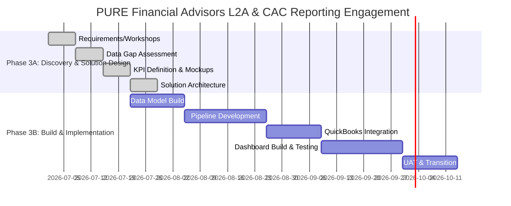

# Approach

This engagement with PURE FINANCIAL ADVISORS LLC is structured to deliver a comprehensive and actionable Lead-to-AUM (L2A) and Customer Acquisition Cost (CAC) reporting solution, fully integrated with the existing Microsoft Fabric and Azure Synapse data platforms. Drawing on best practices in data engineering and business intelligence, our methodology emphasizes collaborative discovery, robust solution design, and scalable implementation. This ensures that enhanced analytics not only meet immediate business requirements but also support future growth and data maturity objectives.

The project follows a two-phase approach, each aligned to specific deliverables and clearly defined timelines. Phase 3A focuses on requirements gathering, data gap assessment, and solution design, while Phase 3B delivers the data model, reporting suite buildout, and full integration with QuickBooks and Salesforce. Power BI will serve as the front-end reporting tool, leveraging batch processing pipelines for dependable and automated data refreshes. Throughout, we will maintain close collaboration with data, technology, and marketing stakeholders to ensure alignment and transparency.

---
**Phase 3A: Discovery & Solution Design, Duration: 3 weeks, Timeline: Week 1 to Week 3**  
**Summary:** Lay the foundation through requirements gathering, data gap assessment, KPI definition, and mock-up development to inform the reporting solution.

**Activities:**  
- Conduct business and data requirements workshops with stakeholders (Jason Carver, Lee Equity Partners, teams).
- Map data flow and perform a data gap assessment across Salesforce, Tamarac, Azure Blob Storage, and QuickBooks.
- Define and document detailed L2A and CAC KPIs, including calculation logic and business rules.
- Develop Power BI dashboard mock-ups (up to 8 views) based on prioritized stakeholder needs.
- Design the high-level data model and technical approach, focusing on integration points—especially QuickBooks ingestion.
- Prepare and present the Phase 3B Implementation Plan outlining tasks, risks, and dependencies.

---
**Phase 3B: Build & Implementation, Duration: 8–12 weeks, Timeline: Week 4 to Week 15**  
**Summary:** Deliver the L2A and CAC data model, implement automated pipelines, integrate data sources, and launch the enhanced Power BI reporting suite.

**Activities:**  
- Build and validate the data model for L2A and CAC in the Microsoft Fabric and Azure Synapse environment.
- Develop automated data ingestion pipelines for Salesforce, QuickBooks, Tamarac, and Azure Blob Storage, emphasizing batch processing.
- Integrate and assess data from QuickBooks to ensure reporting completeness and quality.
- Implement and refine the Power BI dashboards, incorporating defined KPIs and visualizations.
- Conduct user acceptance testing and iterate based on stakeholder feedback.
- Deliver comprehensive documentation: KPI Book, technical approach, and transition materials to enable knowledge transfer and ongoing operations.

---

### Gantt Chart Overview

---

This phased, collaborative approach enables PURE FINANCIAL ADVISORS LLC to address immediate reporting needs—improving insight into pipeline performance and marketing ROI—while building scalable, future-proof data capabilities. By emphasizing stakeholder engagement, technical rigor, and clear documentation, we position stakeholders to achieve both near-term wins and long-term growth. Through each phase, the project team will deliver value at every milestone and ensure seamless transition to ongoing operations.